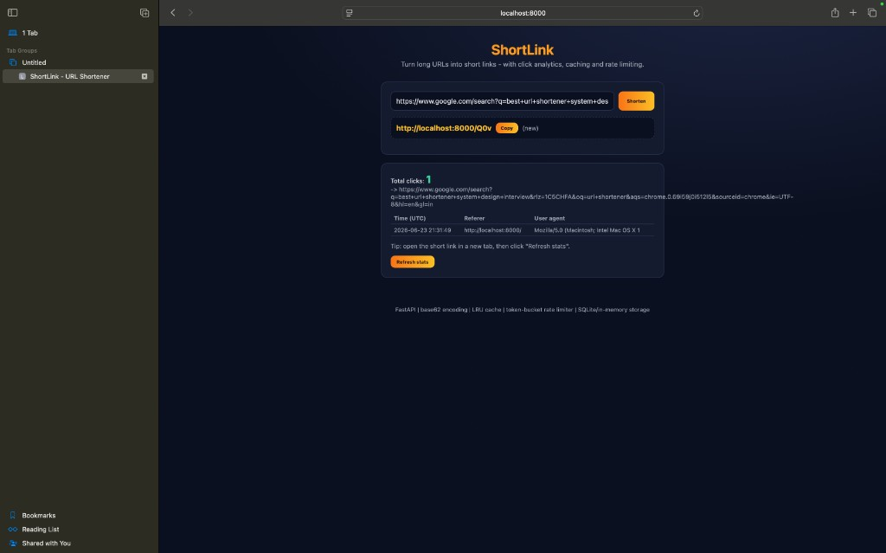

<div align="center">

# ShortLink

### A scalable URL shortener with click analytics - a system-design project

[](https://github.com/BhumikaMahajan87/shortlink/actions/workflows/ci.yml)


Turn long URLs into short links, redirect visitors instantly, and track every
click - built to showcase the core system-design concepts behind services like
Bit.ly and TinyURL.

</div>

---

## What is ShortLink?

ShortLink is a URL shortener. You paste a long link such as
`https://example.com/a/very/long/path?with=query`, and it returns a compact link
like `http://localhost:8000/q0u`. When someone opens the short link they are
redirected to the original URL, and ShortLink records analytics for that click
(timestamp, referer, and user agent).

It is deliberately built around the concepts that come up in **backend / SDE
system-design interviews**: unique ID generation, Base62 encoding, caching,
rate limiting, idempotency, and pluggable storage - all behind a clean REST API
and a simple web dashboard.

> **Zero external dependencies to run.** Uses in-memory storage by default and
> SQLite for persistence - no Redis or Postgres required to try it.

## Demo

Shorten a long URL and watch click analytics update in real time (click count,
timestamp, referer, and user agent for every visit):



The shorten flow turning a long URL into a compact link:


## Key Features

- **Base62 short codes** - dense, collision-free codes generated from a
  monotonic ID sequence (one code per link, no random guessing).
- **Click analytics** - every redirect records a timestamped event with referer
  and user agent, exposed through a stats endpoint and dashboard.
- **LRU caching** on the hot redirect path for fast lookups.
- **Token-bucket rate limiting** per client to absorb bursts and prevent abuse.
- **Idempotency** - shortening the same URL twice returns the same code.
- **Pluggable storage** - a single `Storage` interface with in-memory and SQLite
  implementations (swap in Postgres/Redis without touching business logic).
- **Production hygiene** - typed config, a 27-test suite (run against *both*
  storage backends), Docker support, and CI on Python 3.11 and 3.12.

## Tech Stack

| Layer        | Technology                                        |
| ------------ | ------------------------------------------------- |
| API & Web    | FastAPI, Uvicorn, Pydantic v2                     |
| Encoding     | Custom Base62 encoder/decoder                     |
| Caching      | In-process LRU cache                              |
| Reliability  | Token-bucket rate limiter, input validation       |
| Storage      | In-memory and SQLite (pluggable `Storage` API)    |
| Tooling      | Pytest, Docker, GitHub Actions (CI)               |

## How It Works

```
  POST /api/shorten {url}
        |
        v
  [ validate URL ] -> next_id() -> [ id counter ] -> base62.encode(id) -> code
        |                                                                   |
        | (dedup: reuse code if URL already shortened)                      v
        +------------------------------------------------> store {code -> url}

  GET /{code}
        |
        v
  [ LRU cache ] --miss--> [ storage ] --url--> [ 302 redirect ]
        |
        | (record click: timestamp, referer, user agent -> analytics)
        v
```

## Project Highlights

| Metric                       | Value                                          |
| ---------------------------- | ---------------------------------------------- |
| Automated tests              | 27 (run against both storage backends)         |
| Python versions tested       | 3.11 and 3.12                                  |
| Storage backends             | 2 (in-memory + SQLite, interchangeable)        |
| External services required   | 0 - runs fully offline                         |
| Code length (5 chars)        | covers ~916 million unique links               |

## Getting Started

```bash
# 1. Install (no external services needed)
pip install -r requirements.txt

# 2. Run
uvicorn app.main:app --reload

# 3. Open
#    Web UI:           http://localhost:8000
#    Interactive API:  http://localhost:8000/docs
```

### Run with Docker

```bash
docker compose up --build
```

## API Reference

| Method | Endpoint            | Description                                  |
| ------ | ------------------- | -------------------------------------------- |
| POST   | `/api/shorten`      | Shorten a URL -> `{code, short_url, ...}`    |
| GET    | `/{code}`           | Redirect (302) to the long URL + log a click |
| GET    | `/api/stats/{code}` | Click count + recent click events            |
| GET    | `/api/health`       | Health check + total links                   |

```bash
# Shorten
curl -X POST http://localhost:8000/api/shorten \
  -H "Content-Type: application/json" \
  -d '{"url": "https://example.com/some/very/long/path"}'

# Visit (redirects + records a click)
curl -i http://localhost:8000/q0u

# Analytics
curl http://localhost:8000/api/stats/q0u
```

## Scaling Notes (interview talking points)

- **Storage**: swap `SqliteStorage` for PostgreSQL/DynamoDB by implementing the
  same `Storage` interface.
- **Distributed ID generation**: replace the single counter with a range-based
  allocator (each instance leases a block of IDs) or a Snowflake-style ID.
- **Shared cache**: move the in-process LRU to Redis so all app instances share
  hot lookups.
- **Analytics at scale**: push click events to a queue (e.g. Kafka) and
  aggregate asynchronously instead of writing on the redirect path.

## Testing

```bash
pytest -q
```

The service tests run against **both** the in-memory and SQLite backends to
guarantee the `Storage` interface behaves identically.

## Author

**Bhumika Mahajan**
[GitHub](https://github.com/BhumikaMahajan87) · [LinkedIn](https://www.linkedin.com/in/bhumika-mahajan-90ba90388/)

## License

Released under the MIT License.
